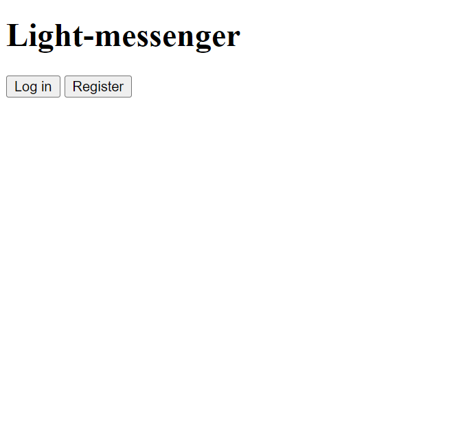
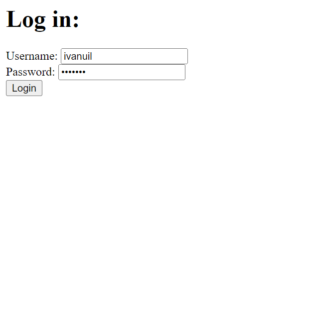
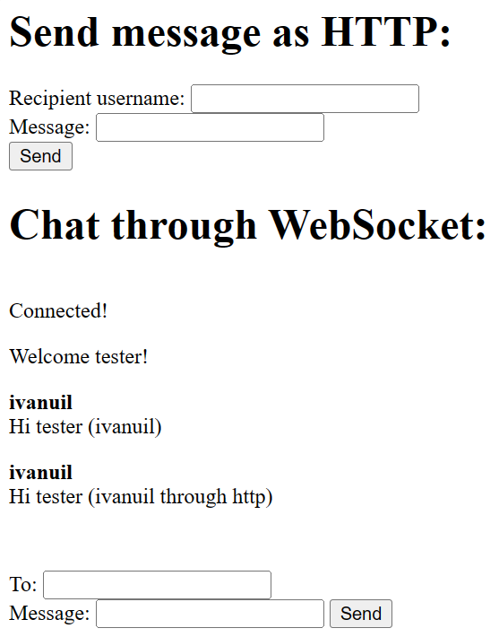

## Light-messenger

### About

Light-messenger это простой мессенджер использующий Kafka и WebSocket для доставки сообщений.







Благодаря использованию WebSocket пользователь получает сообщения без обновления страницы.
Но отправка сообщений также возможно через Http запрос.

### Stack

* Spring Boot
* Kafka
* PostgreSQL
* WebSocket

### How to run

1. Запустить Zookeeper, Kafka и Postgres.

    В [docker-compose.yml](util/docker-compose.yml) имеется готовая конфигурация для запуска в Docker.
    В случае запуска иным образом возможно потребуется изменить URL и порты в [application.properties](src/main/resources/application.properties)

2. Запустить сервис

3. Запустить NodeJs сервер выполнив команду ```npm start```
в директории /web

4. Домашняя страница будет доступна по адресу http://127.0.0.1/
